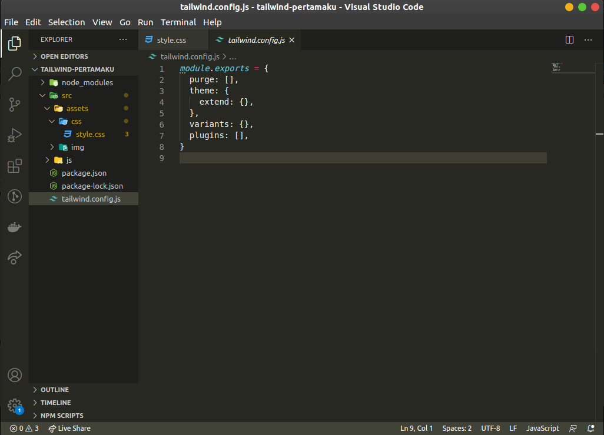
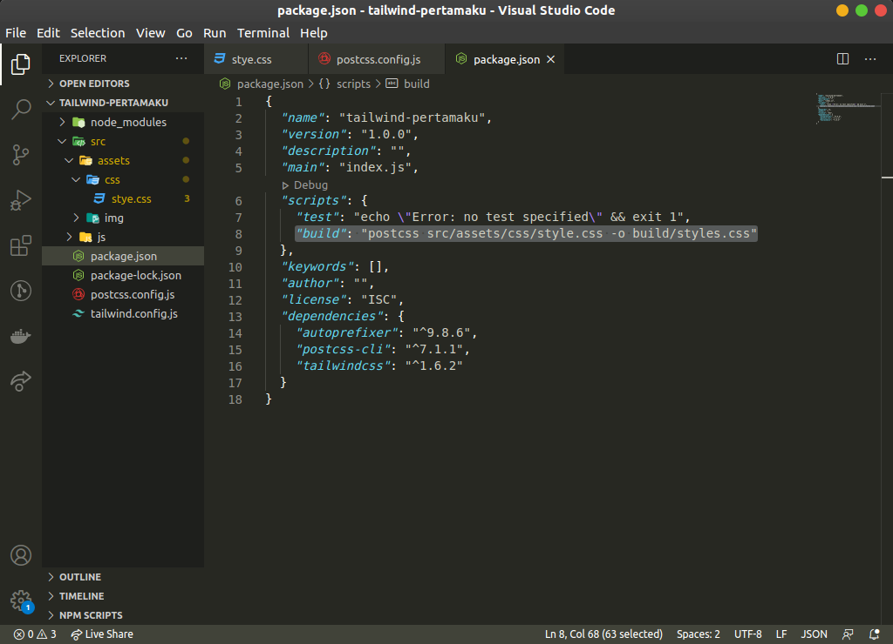

# HTML ♥️ Tailwindcss
Hallo terima kasih karena telah mampir ke github ku! :two_hearts:

## Link for live version
[Klik aku](https://dickyfahlevi21.github.io/)

## Apa itu Tailwind CSS?
Tailwind CSS is a highly customizable, low-level CSS framework that gives you all of the building blocks you need to build bespoke designs without any annoying opinionated styles you have to fight to override. [Sumber](https://tailwindcss.com/).

## Persiapan
Karena aku menggunakan Ubuntu, jadi aku memberikan tutorial versi ubuntu ya!:trollface:

disini akan menggunakan [NPM](https://www.npmjs.com/get-npm), jadi pastikan kalian sudah menginstall [NPM](https://www.npmjs.com/get-npm) sebelum memulai langkah berikutnya ya.


buat folder nya dulu yuk
```bash
$ mkdir tailwind-pertamaku
```

lalu masuk kedalam folder yang tadi sudah dibuat
```bash
$ cd tailwind-pertamaku
```

dan buat file package.json dengan menggunakan perintah [NPM](https://www.npmjs.com/get-npm) dengan cara berikut:
```bash
$ npm init -y
```


lalu kita install tailwindcss
```bash
$ npm install tailwindcss
```


Langkah selanjutnya buka project tailwind-pertamaku di code editor kamu, lalu buat folder src/assets/css/style.css, dan masukan code berikut ke file style.css

```python
@tailwind base;

@tailwind components;

@tailwind utilities;
```


Nanti, saat menjalankan proses build Tailwind CSS, file style.css tersebut akan terhubung dengan kode CSS Tailwind.

## Membuat File Konfigurasi Tailwind


```bash
$ npx tailwindcss init
```

Perintah ini membuat file baru bernama tailwind.config.js dengan isi file sebagai berikut:





## Memproses CSS dengan Tailwind

```bash
$ npm install postcss-cli autoprefixer
```

```bash
$ touch postcss.config.js
```


Masukan kode dibawah ini kedalam file postcss.config.js

```python
module.exports = {
    plugins: [
        require('tailwindcss'),
        require('autoprefixer'),
    ]
}
```


Lalu masukan kode berikut kedalam file package.json
```python
"build": "postcss src/assets/css/style.css -o build/styles.css"
```

Menjadi seperti ini, perhatikan line: 6 - 9 , masukan kode berikut kedalam tulisan "script", dan jangan lupa memberikan ","(koma) pada akhir line "test"




lalu jalankan perintah
```bash
$ npm run build
```

maka akan terbentuk folder build yang berisi style.css


lalu buat file index.html dan masukan kode berikut untuk memastikan tailwindcss, sudah terinstall dengan baik

```python
<!DOCTYPE html>
<html lang="en">

<head>
    <meta charset="UTF-8">
    <meta name="viewport" content="width=device-width, initial-scale=1.0">
    <link rel="stylesheet" href="./build/styles.css">
    <title>Tailwind Pertamaku</title>
</head>

<body>
    <div class="lg:container lg:mx-auto content-center">
        <div class="w-full max-w-xs text-center mx-auto mt-6">
            <form class="bg-white shadow-md rounded px-8 pt-6 pb-8 mb-4">
                <div class="mb-4">
                    <label class="block text-gray-700 text-sm font-bold mb-2" for="username">
                        Username
                    </label>
                    <input
                        class="shadow appearance-none border rounded w-full py-2 px-3 text-gray-700 leading-tight focus:outline-none focus:shadow-outline"
                        id="username" type="text" placeholder="Username">
                </div>
                <div class="mb-6">
                    <label class="block text-gray-700 text-sm font-bold mb-2" for="password">
                        Password
                    </label>
                    <input
                        class="shadow appearance-none border rounded w-full py-2 px-3 text-gray-700 mb-3 leading-tight focus:outline-none focus:shadow-outline"
                        id="password" type="password" placeholder="******************">
                </div>
                <div class="flex items-center justify-between">
                    <button
                        class="bg-blue-500 hover:bg-blue-700 text-white font-bold py-2 px-4 rounded focus:outline-none focus:shadow-outline"
                        type="button">
                        Sign In
                    </button>
                    <a class="inline-block align-baseline font-bold text-sm text-blue-500 hover:text-blue-800" href="#">
                        Forgot Password?
                    </a>
                </div>
            </form>
            <p class="text-center text-gray-500 text-xs">
                &copy;2020 Acme Corp. All rights reserved.
            </p>
        </div>
    </div>
</body>

</html>
```


jika tampilan yang dihasilkan seperti ini, selamat kamu telah sukses meng-install tailwindcss pada project mu! :)

